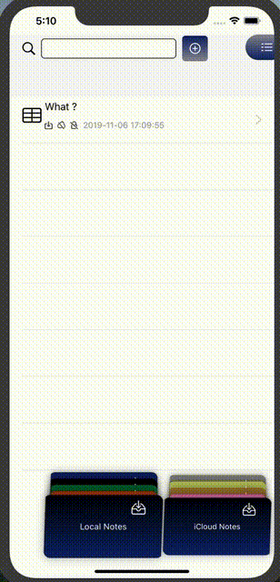
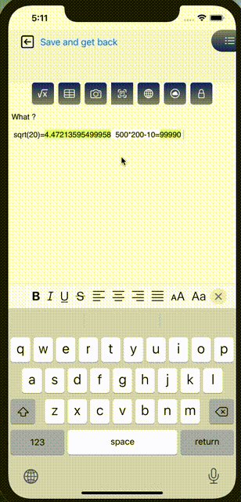
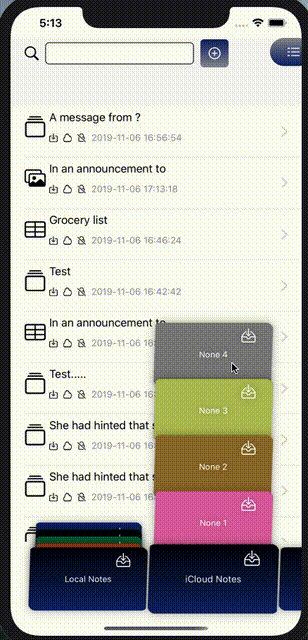
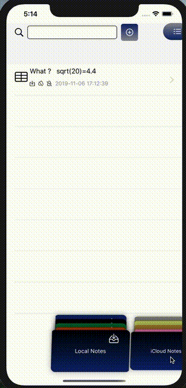

# DaoNotes

This application is for managing notes and various widgets inside them. This project is an attempt to test SwiftUI how efficient it is to use. This is the demo project.

## Menu

  

 
 
 
Although this application is mainly intended for experiments, it implements all the basic necessary functionality of such  applications. Notes can be edited, changed text styles, made copy / past. Also, it supports tables, images, etc.
## To edit a note

  

 
 
 
## Additional elements

  

 
 
 
Notes can be stored locally or in the cloud. They can also be shared with other users. If there has been a change in such notes, a notification will be received.
## iCloud

  

 
 
 
The app also supports customizing the colors of menus and buttons and other simple settings.
## Settings

  

