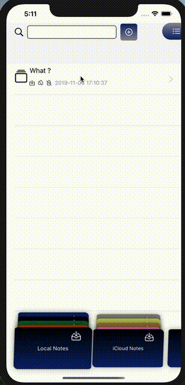

# DaoNotes
This application is for saving and managing notes and various widgets inside them. This project is an attempt to test SwiftUI how efficient and easy it is to use.

Although this application is mainly intended for experiments, it nonetheless implements all the basic necessary functionality of such  applications. 

Notes can be edited, changed text styles, made copy / past, pasted tables, images, etc.

Notes can be stored locally or in the cloud they can also be shared with other users. If there has been a change in such notes, a notification will be received.
 
 
